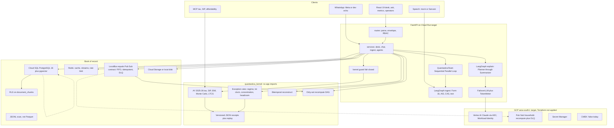
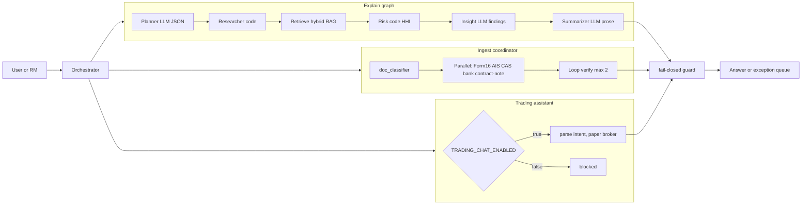
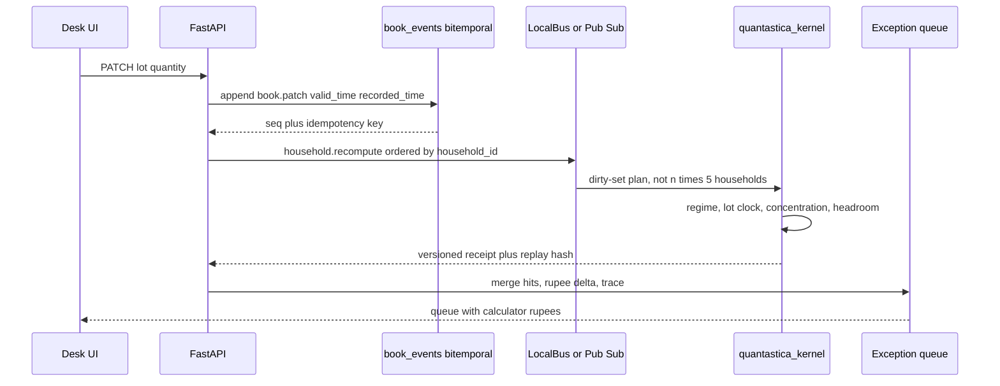

# Quantastica

A grounded intelligence layer for Indian HNI books and bank RM desks.
The model classifies and writes. Calculators and the mock bank book supply every
rupee. It does not invent figures.

This is not investment advice, not a SEBI-registered advisory, and not a solicitation
to buy or sell any security. If a bank deploys it, the bank remains the regulated
adviser. Quantastica computes.

**Read first:** [docs/product.md](docs/product.md) (GTM),
[docs/system-design.md](docs/system-design.md) (target),
[docs/demo.md](docs/demo.md) (script),
[docs/trust-center.md](docs/trust-center.md) (honesty table).
This README is the running system: architecture, GCP mapping, how to run, how to
gate.

## Invariant

The kernel is the only source of numbers. Vertex AI (GCP), Gemini, or Anthropic
classify, extract, and narrate. A fail-closed guard blocks any rupee that is not
in a calculator receipt or a source quote. Copy is informational only.

## System architecture



### What the diagram claims, and what it does not

| Box | Today | Honest limit |
|---|---|---|
| Vertex AI | Factory path when `PLATFORM=gcp` (`AsyncAnthropicVertex`, ADC) | Local default is Gemini or Anthropic. No live GCP project in CI. |
| Cloud SQL | Same Postgres 16 + pgvector contract | Local Docker or testcontainers. `infra/gcp/main.tf` is plan-only. |
| Cloud Pub Sub | `PubSubShim` shares `LocalBus` envelopes | Factory events still publish Redis Streams until credentials exist. |
| Cloud Storage | GCS adapter when `PLATFORM=gcp` | Local disk otherwise. |
| Secret Manager | Sketched in Terraform | No secrets bound. Never commit a key file. |
| Cloud Run | Intended host | Not deployed. |
| CMEK | Documented as false | Do not claim encryption keys. |
| Google ADK | Not imported | Sequential, Parallel, Loop in `app/team` is the portable graph. |
| DuckDB, PyArrow, Firestore | Not required | OLAP is JSONL. Book is Postgres. |

AWS Mumbai adapters (Bedrock, S3, SQS) stay in the factory so a later port is a
swap, not a rewrite. See [docs/adr/007-residency.md](docs/adr/007-residency.md).

## Agentic control flow

Two graphs, one team wrapper. The kernel is not an agent. Sub-agent depth is at
most 2.



Planner, Insight, and Summarizer call the LLM at temperature 0 for JSON, retry
once on schema failure, then fail. Researcher and Risk never call a model.
Retrieve is LlamaIndex sentence chunks, Voyage or hashing embeddings, pgvector
cosine plus Postgres BM25, fused with reciprocal rank fusion, scoped by
`SET LOCAL app.current_user_id`.

MCP (`python -m app.mcp`) exposes the same tax, SIP, and affordability
calculators to Cursor and Claude Desktop. It does not expose a free-form model.

## Money path: book change to exception queue



A household rename dirties nothing. A snapshot or unknown event type fails
closed and dirties every rule. Other households are never in the dirty set.

## Layering

Dependencies point downward only.

```
apps/web          React 19, Vite, Tailwind, TanStack Query
apps/server/app
  routes          HTTP parse, RBAC, envelope
  services        desk, chat, ingest, documents, agents
  agents          LangGraph explain plus retrieve
  team            Sequential, Parallel, Loop around ingest
  ingest          extractors, Mock VLM, LangGraph
  infra           factory: repo, llm, events, storage, cache
  providers       bank mock, paper broker, Kite stub, news, embeddings, AA
quantastica_kernel   pip-installable, pydantic only, no app imports
packages/types    contracts.json plus Zod
```

`GET /api/platform` reports which slots are actually ready. Prod startup aborts
if required env is missing, naming each variable.

## Repository map

| Path | Role |
|---|---|
| `apps/server/quantastica_kernel` | Isolated kernel: calculators, exceptions, temporal, recompute, guard, DST |
| `apps/server/app` | FastAPI application |
| `apps/server/evals` | `golden_india.json` plus release catalog |
| `apps/server/kernel_tests` | Unittest with kernel only |
| `apps/web` | Desk, Ask, Planning, Metrics, Operators, Demo |
| `infra/gcp` | Plan-only Terraform: Pub Sub, Cloud SQL, GCS, Secret Manager, asia-south1 |
| `infra/aws` | Portable adapters note, not applied |
| `tenants/northstar.json` | FDE tenant spec |
| `tools/synthgen` | Seeded synthetic books |
| `tools/fde` | Onboard layout packs |
| `docs/` | Product, phases 0-18, ADRs, compliance, trust |

## Surfaces

| Path | Who | What |
|---|---|---|
| `/` | Public | Landing |
| `/desk` | RM | Exception queue, ingest, voice, lot edits |
| `/ask` | RM or client | Chat: tax, SIP, portfolio, documents. Grounded. |
| `/planning` | RM | Goals, SIP, affordability |
| `/metrics` | Pitch | Households, rupees, golden gate, FDE, OLAP engine |
| `/operators` | SRE | Platform readiness, flags, trust JSON |
| `/demo` | Sales | Scripted Form 16 plus bonus |
| `/api/docs` | Dev | OpenAPI, off in prod |
| `python -m app.mcp` | IDE | Calculator tools |
| `python -m app.offline_demo` | Proof | No Postgres, no keys, port 8010 |

Match, paper trades, automation, and WhatsApp stay in code, off the primary
household nav. Conversational trading is off until `TRADING_CHAT_ENABLED=true`.

## What is real today

| Loop | What happens |
|---|---|
| Exception queue | Desk home. Regime, lot clock, concentration, deduction headroom. Calculators only. |
| Tax, SIP, affordability | Deterministic kernel. LLM narrates the receipt. |
| Portfolio concentration | Explain graph. Researcher and Risk are pure code. |
| Documents | Chunk, embed, hybrid retrieve, cite. Needs embeddings. Hashing embeddings in CI. |
| Ingest | Form 16, AIS, CAS, text, Hinglish `barah lakh` = Rs 12,00,000. Mock VLM in CI. Low confidence pauses. |
| Voice | Mock STT and TTS. Spoken questions read the queue. Sarvam when keyed. 1500 ms budget. |
| Northstar books | Mehta and Rao lots. `make seed-small`. |
| Guard | Ungrounded rupees and advice phrases fail closed. |
| DSR | Access for adviser-plus. Erasure for admin. Dev `user` maps to adviser. |
| Evals | Golden India plus catalog gates. RAGAS optional, never required to merge. |

## GCP factory mapping

`PLATFORM=local | gcp | aws`. Postgres and Redis on every platform.

| Component | local | gcp (asia-south1 target) | aws (portable) |
|---|---|---|---|
| LLM | Anthropic or Gemini | Vertex AI Claude, ADC, Workload Identity | Bedrock |
| Storage | disk | GCS | S3 |
| Events | Redis Streams plus LocalBus | PubSubShim, same envelopes | SQS later |
| Repo | Postgres 16 + pgvector | Cloud SQL same engine | RDS same engine |
| Secrets | `.env`, never committed | Secret Manager when applied | IAM |

Required when `PLATFORM=gcp`: `GCP_PROJECT`, `GCP_REGION` (use `asia-south1`),
`VERTEX_MODEL`, `GCS_BUCKET`. Terraform: `infra/gcp/main.tf`. It has not been
applied. See [docs/cloud-gcp.md](docs/cloud-gcp.md).

## Offline proof demo (Phase 0)

After setup, `make demo`, then http://127.0.0.1:8010. No Postgres, Redis, model
key, or network. `pip install ./apps/server/quantastica_kernel` installs the
kernel alone. `make kernel-check` checks golden amounts, receipt replay,
bitemporal reconstruction, and dirty-set planning.

Phase notes: [0 kernel](docs/phase-0-kernel.md),
[1 bitemporal](docs/phase-1-bitemporal.md),
[2 recompute](docs/phase-2-recompute.md),
[3 to 18](docs/phases-3-18.md).

## Local run

You need Postgres 16 with pgvector, Redis, one LLM key, then:

```
make setup
# add ANTHROPIC_API_KEY or GEMINI_API_KEY to apps/server/.env. Do not commit it.
docker compose up postgres redis
# from apps/server:
alembic upgrade head
make seed
make dev
```

Open `http://localhost:5173/desk`, select Mehta, confirm at least two exceptions.
Change a lot quantity. The queue updates. That is the product.

```
curl localhost:8000/api/health
curl localhost:8000/api/desk/households
curl localhost:8000/api/desk/households/hh_mehta/queue
curl localhost:8000/api/control/trust
curl localhost:8000/api/control/evals
```

`docker compose up --build` starts API, worker, web, Postgres, and Redis.
Seed with `curl -X POST localhost:8000/api/seed/load` (`ALLOW_SEED=true`).

## HTTP envelope

Every `/api/*` body:

```json
{ "ok": true, "data": {}, "error": null, "meta": { "requestId": "...", "version": "2.0.0" } }
```

Stable codes include `NOT_FOUND`, `VALIDATION_ERROR`, `LLM_ERROR`,
`PLATFORM_NOT_CONFIGURED`, `AUTH_REQUIRED`, `FORBIDDEN`, `RATE_LIMITED`,
`INTERNAL_ERROR`. Stack traces and secrets are never returned.

### Primary routes

| Prefix | Role |
|---|---|
| `/api/health`, `/api/ready`, `/api/platform` | Liveness, DB and Redis, factory slots |
| `/api/desk` | Households, queue, lot patch, recompute, as-of, history |
| `/api/ingest` | Form 16, AIS, CAS, text; resume on interrupt |
| `/api/speech` | Transcribe then ingest or queue script |
| `/api/chat` | Classifier then grounded calculator or explain graph |
| `/api/agents` | Run explain graph, list traces, export |
| `/api/documents` | Ingest and list user-scoped chunks |
| `/api/control` | Evals, dashboards, trust, DSR, SLO synthetic page, FDE layout |
| `/api/calc`, `/api/tax` | SIP, simulate, regime compare |
| `/api/bank` | Mock Northstar |
| `/api/trades` | Paper intents; live gated |
| `/api/match` | Deterministic loan and insurance scores |
| `/api/mcp` | via stdio, not HTTP |

## Dev vs prod

`APP_ENV` is `dev` or `prod`. Prod startup aborts if required vars are missing.

| Concern | dev | prod |
|---|---|---|
| PLATFORM | `local` default | GCP asia-south1 planned; AWS adapter retained |
| Auth | `REQUIRE_AUTH=false` allowed | forced on, JWT secret 32+ bytes |
| CORS | localhost origins | explicit `CORS_ORIGINS`, refuses `*` |
| Seed | `make seed` | off unless `ALLOW_SEED=true` |
| Logging | console | JSON with request ids |
| OpenAPI | on | off |
| Trading | paper | paper unless live gates and Kite env |

## Testing and gates

```
make check        # ruff, typecheck, pytest, vitest, contract, em dash, kernel, evals, DST
make test         # backend pytest plus frontend vitest
make eval         # golden India plus catalog
make dst          # seeded reorder, duplicate, delay, drop
make fde          # Northstar layout packs
make kernel-check # isolated kernel plus offline smoke
```

CI (`.github/workflows/ci.yml`):

1. Kernel job: `pip install ./apps/server/quantastica_kernel` only, then unittest.
2. Backend: ruff, `alembic upgrade head`, pytest, evals, offline smoke.
3. Frontend: lint, typecheck, vitest, build.
4. Repo: contract version plus em dash scan.

Integration tests use testcontainers (Postgres plus Redis). LLM is a fake in
pytest. Superusers bypass RLS; the RLS test queries as a `NOBYPASSRLS` role.

## FDE and synthgen

```
PYTHONPATH=apps/server python -m tools.synthgen --tier small --seed 42
PYTHONPATH=. python -m tools.fde onboard --config tenants/northstar.json
```

Large synthgen reports a count and writes a sample. It does not materialize
100k rows.

## Compliance pointers

- [docs/compliance/dpdp.md](docs/compliance/dpdp.md): masking, consent, DSR.
- [docs/compliance/trading.md](docs/compliance/trading.md): paper first.
- [docs/compliance/vendor-risk.md](docs/compliance/vendor-risk.md): processors.
- [docs/adr/007-residency.md](docs/adr/007-residency.md): asia-south1 target.

## Docs index

| Doc | Contents |
|---|---|
| [docs/product.md](docs/product.md) | Buyers, not a mass SIP app |
| [docs/architecture.md](docs/architecture.md) | Code layout |
| [docs/agentic-design.md](docs/agentic-design.md) | Graph nodes and grounding |
| [docs/runbook.md](docs/runbook.md) | Operate locally |
| [docs/cloud-gcp.md](docs/cloud-gcp.md) | Vertex, Cloud SQL, Pub Sub, GCS |
| [docs/cloud-aws.md](docs/cloud-aws.md) | Portable factory |
| [docs/phases-3-18.md](docs/phases-3-18.md) | Bus through FDE and SLOs |
